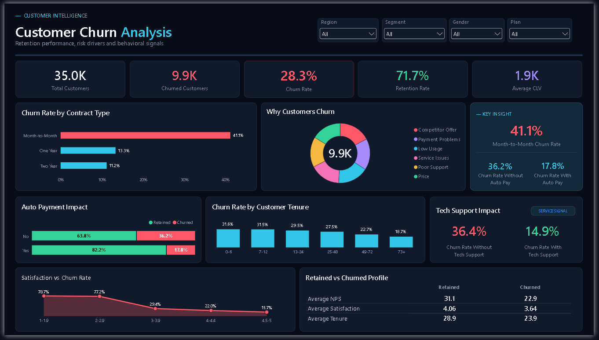
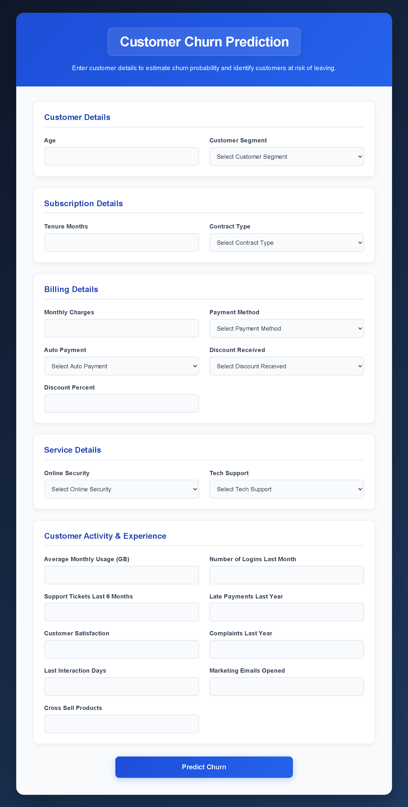

# Customer Churn Prediction & Analysis

An end-to-end customer churn project that combines **PostgreSQL, Python, Machine Learning, Power BI, and Flask** to analyze churn behavior, identify important retention patterns, and predict whether a customer is likely to churn.

---

## 🛠️ Tech Stack

<p align="left">
  
  
  
  
  
  
  
  
</p>

<p align="left">
  
  
  
  
  
  
  
</p>

---

## 📌 Project Overview

The goal of this project is to understand customer churn, identify patterns associated with higher churn, build a classification model for customer-level prediction, and present the results through an interactive Power BI dashboard and a Flask web application.

---

## 🎯 Business Objectives

The main objectives of the project are to:

- Understand the overall churn level in the customer base
- Identify customer, billing, service, and behavioral factors associated with churn
- Compare churn patterns across different customer groups
- Build a machine learning model to predict customer churn
- Create an interactive Power BI dashboard for churn analysis
- Build a Flask application that returns both a churn prediction and churn probability

---

## 📊 Dataset Overview

The dataset used in this project contains:

- **35,000 customer records**
- **36 original columns**
- **No missing values**
- **No duplicate rows**
- Overall churn rate: **28.28%**

Detailed EDA, feature selection, preprocessing, and model comparison are available in the Jupyter notebook.

---

## 🔄 Project Workflow

```text
            Customer Dataset
                    ↓
           PostgreSQL Database
                    ↓
         Python / Jupyter Notebook
                    ↓
         Data Quality Checks & EDA
                    ↓
      ┌────────────────────────────────────┐
      ↓                                    ↓
Power BI Dashboard        Feature Selection & Preprocessing
      ↓                                    ↓
Business Insights               Machine Learning Model
                                           ↓
                                   Model Evaluation
                                           ↓
                                 Saved Model Artifacts
                                           ↓
                                 Flask Web Application
                                           ↓
                                   Churn Prediction
```
---

## 📈 Power BI Dashboard

The dashboard covers overall churn and retention KPIs, contract type, auto payment, tech support, tenure, satisfaction, churn reasons, and retained vs churned customer profiles.

Power BI file:

```text
dashboard/Customer_Churn_Dashboard.pbix
```

### Dashboard Preview



---

## 🔍 Key Business Insights

The analysis found that:

- Month-to-Month customers have substantially higher churn than customers on longer contracts.
- Auto payment is associated with a much lower churn rate.
- Tech support is associated with a much lower churn rate.
- Online security is also associated with lower churn.
- Customers who received discounts showed lower churn than customers who did not receive discounts.
- Cash and Debit Card users showed relatively higher churn rates than other payment methods.
- Higher customer tenure and satisfaction are associated with lower churn.

These patterns can help identify customer groups that may require stronger retention strategies.

---

## 🤖 Machine Learning

After feature selection, 20 input features were retained for model training. Categorical features were encoded using OneHotEncoder and LabelEncoder, resulting in 26 model features. The transformed features were then standardized using `StandardScaler`.

**Logistic Regression** was selected as the final model.

| Metric | Result |
|---|---:|
| Accuracy | **81.54%** |
| Churn Precision | **71%** |
| Churn Recall | **58%** |
| Churn F1-Score | **64%** |

The model provides a useful baseline for churn prediction, while churn recall remains an area for future improvement.

---

## 🌐 Flask Web Application

A Flask web application was created to make predictions using the saved model and preprocessing objects.

The application:

1. Collects 20 customer inputs from the HTML form
2. Applies the saved categorical encoders
3. Reorders the transformed data using `feature_columns.pkl`
4. Applies the saved `StandardScaler`
5. Generates a Logistic Regression prediction
6. Calculates churn probability using `predict_proba()`
7. Displays the result on the web page

The prediction result is displayed as:

```text
Customer is likely to Churn
```

or:

```text
Customer is not likely to Churn
```

The application also displays the predicted **Churn Probability**.

The result card is visually styled differently for churn and no-churn predictions.

---

### Web Application Preview

#### Prediction Form

<p align="center">
  
</p>

<details>
  <summary><b>View prediction examples</b></summary>
  <br>
  <table>
    <tr>
      <td width="50%" align="center">
        <b>Churn Prediction</b><br><br>
        
      </td>
      <td width="50%" align="center">
        <b>No-Churn Prediction</b><br><br>
        
      </td>
    </tr>
  </table>
</details>

---

## 📂 Project Structure

```text
customer-churn-prediction-analysis/
│
├── app/
│   ├── app.py
│   ├── static/
│   │   └── style.css
│   └── templates/
│       └── index.html
│
├── dashboard/
│   ├── Customer_Churn_Dashboard.pbix
│   └── Customer_Churn_Dashboard.png
│
├── data/
│   └── customer_churn_dataset.csv
│
├── documentation/
│   └── data_dictionary.csv
│
├── images/
│   ├── web_app_interface.png
│   ├── churn_prediction.png
│   └── no_churn_prediction.png
│
├── model/
│   ├── encoders.pkl
│   ├── feature_columns.pkl
│   ├── prediction_model.pkl
│   └── scaler.pkl
│
├── notebooks/
│   └── Customer_Churn_Prediction.ipynb
│
├── sql/
│   └── customer_churn_database_setup.sql
│
├── .gitignore
├── LICENSE
├── README.md
└── requirements.txt
```

---

## 🚀 How to Run the Project

### 1. Clone the Repository

```bash
git clone https://github.com/kamranakhter03/customer-churn-prediction-analysis.git
cd customer-churn-prediction-analysis
```

### 2. Install Dependencies

```bash
pip install -r requirements.txt
```

### 3. Run the Flask Application

From the project root directory:

```bash
python app/app.py
```

### 4. Open in Browser

```text
http://127.0.0.1:5000
```

---

## 📓 Running the Notebook

To run the complete analysis notebook, PostgreSQL must be available locally.

The notebook expects:

```text
Database: customer_churn_db
Table: customer_churn
```

Set your PostgreSQL password through the `POSTGRES_PASSWORD` environment variable before running the notebook.

The SQL setup file is available at:

```text
sql/customer_churn_database_setup.sql
```

---

## 🔮 Future Improvements

Based on the model evaluation, future work could include:

- Improving churn recall through model tuning
- Applying techniques for handling class imbalance
- Comparing additional tuned classification models
- Optimizing the prediction threshold based on business requirements
- Deploying the Flask application to a cloud platform

---

## ✅ Conclusion

This project demonstrates an end-to-end customer churn workflow covering **database integration**, **exploratory data analysis**, **feature selection**, **machine learning**, **Power BI visualization**, and **Flask integration**.

The final Logistic Regression model achieved approximately **81.54% accuracy** and was integrated into a Flask application that provides both a churn prediction and churn probability for individual customers. The Power BI dashboard complements the predictive model by providing an interactive view of retention performance, churn patterns, and customer behavior.

---

## 👤 Author

**Mohammad Kamran Akhter**

- GitHub: https://github.com/kamranakhter03
- LinkedIn: https://www.linkedin.com/in/kamranakhter03/

---

## 📜 License

This project is licensed under the [MIT License](LICENSE).